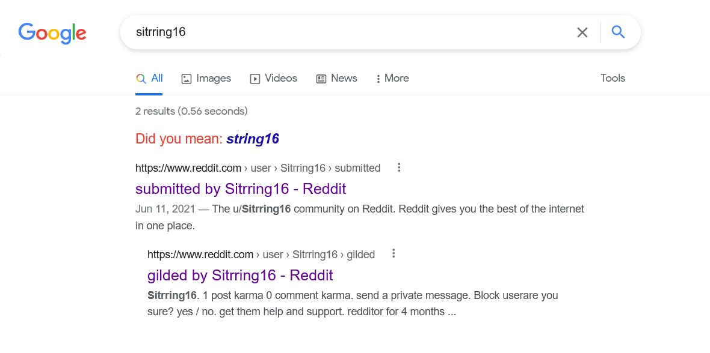
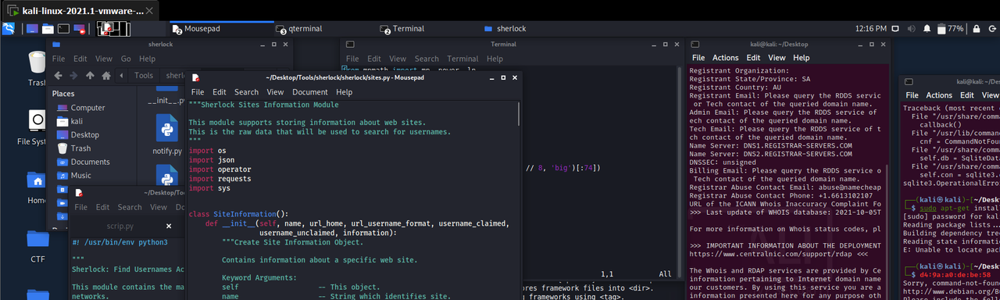
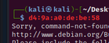
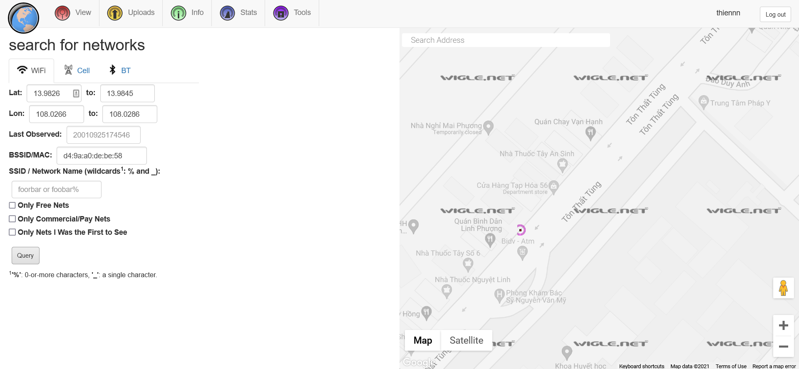

# Can you catch me

## Description

Stirring16 stole our data remotely. But he did reveal his whereabouts on a forum. Where can you find him? Format flag: flag{Street-names}

## Solution

The original name was `Sitrring16`, I search with Google search and there are 2 results about an account on reddit forum

In this account, there is only one comment and its content is deleted.

I have tried many times to search all posts, comments about this account, and other forum which nickname `Stirring16` and `Sitrring16` but I didn't find any thing relevant. 

Back to reddit forum I think account profile and cover photos is suspicious. First, I downloaded the profile photo but its content can't be read 'cause the resolution is bad. Fortunately, the cover photo has much information to retrieve. I noticed that at the bottom-right corner, I see an address like a MAC address, like the description this address must be the hint to the answer: **he reveal his whereabouts on a forum**

At the bottom-right corner, the address like MAC is `d4:9a:a0:de:be:58`

I found him by [this website](https://www.wigle.net/)

## Flag

> Flag is flag{Ton-That-Tung}