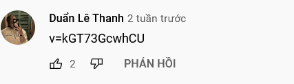
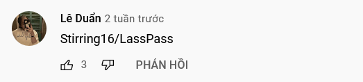
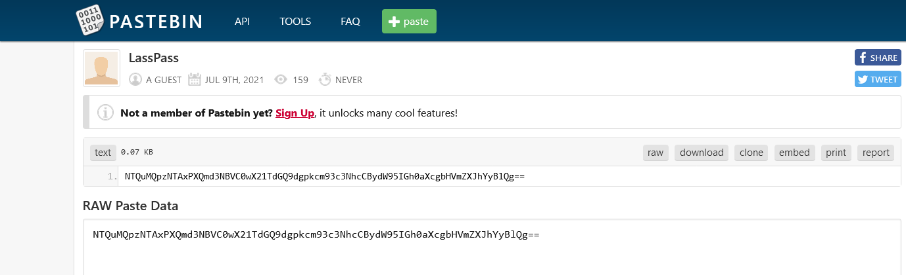

# Thấy chuyện bất bình, chụp màn hình gửi quý dzị

## Description

Cách đây không lâu, một admin của diễn đàn công nghệ trong 1 lần review trải nghiệm sản phẩm đã vô tình làm lộ mật khẩu của mình, bạn có thể tìm ra password này là gì không? Hint: v=BtulL3oArQw Format flag: flag{textpassword}

## Solution

First, I have doubts about hint, it is similar to Youtube slug (`v=BtulL3oArQw`). Follow that, read the comment on that video give me another Youtube slug (`v=kGT73GcwhCU`)



Follow new video, read the comment and that give me a Github repo



Follow that repo and read all commit history, I found the `CODE` in commit `05349ce` and full pastebin link in commit `9642395`, which is [https://pastebin.com/D6MQgdyv](https://pastebin.com/D6MQgdyv)

Follow the pastebin link, I have a base64-encoded string `NTQuMQpzNTAxPXQmd3NBVC0wX21TdGQ9dgpkcm93c3NhcCBydW95IGh0aXcgbHVmZXJhYyBlQg==`



Decode the base64-encoded string, I get 

```
54.1
s501=t&wsAT-0_mStd=v
drowssap ruoy htiw luferac eB
```

Read from right-to-left, I get another Youtube slug and number like timestamp of the video. Follow the video at the minute 1.45, there is the password in the video frame.

## Flag

> flag{gernuv-2jiKke-vywjec}