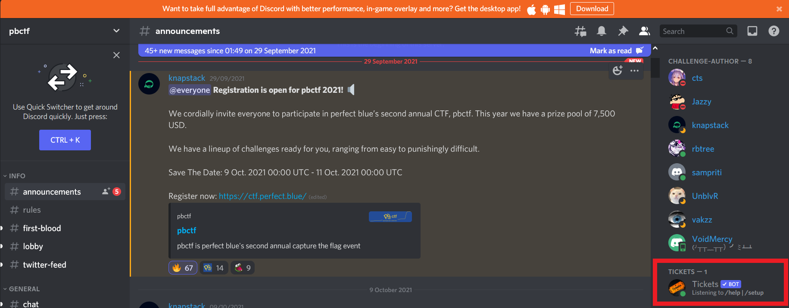

# contact

## Description

I like Bot gg/GXtshq7Qwe format flag: flag{namebot}

## Solution

With my experience about Discord, I sure this is a Discord bot, and the `gg/GXtshq7Qwe` is the slug to join a Discord server, which the fully-qualified URL is `https://discord.com/invite/GXtshq7Qwe` or `discord.gg/GXtshq7Qwe`

That URL redirect to **pbctf server** and the only bot in the server is `Tickets`

## Flag

> flag{Tickets}