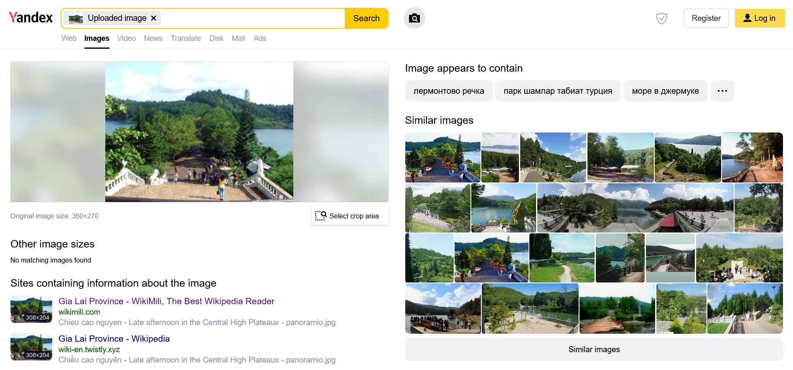

# Eyes

## Description

Sing with me: You are very beautiful.... format flag: flag{name-of-this-place}

[image](files/eyes-chall-description.jpg)

## Solution

First, I use Yandex image search engine to find similar images to this challenge image, and I found 3 wiki link which image's description on that page written in Vietnamese.

Follow the [third link](https://en.wikipedia.org/wiki/Gia_Lai_Province), and continue with the first picture on the right sidebar, which reveal me the location of the image.

With my knowledge about `Gia Lai` landscape and the location of the picture, I know this place is Biển Hồ.

## Flag

> flag{Bien-Ho}