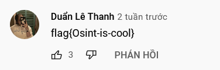

# Music

## Description

Do you like number 17076? Do you like listening to music? Format flag: flag{....}

[File](files/Music-2.txt)

## Solution

At the character 17076 in the file, I found a string that similar to Youtube slug, `v-=-5-m-4-Q-c-G-C-B-o-C-0` or [https://www.youtube.com/watch?v=5m4QcGCBoC0](https://www.youtube.com/watch?v=5m4QcGCBoC0).

And I sorted the comments on this video by newest first, found the answer

## Flag

> flag{Osint-is-cool}