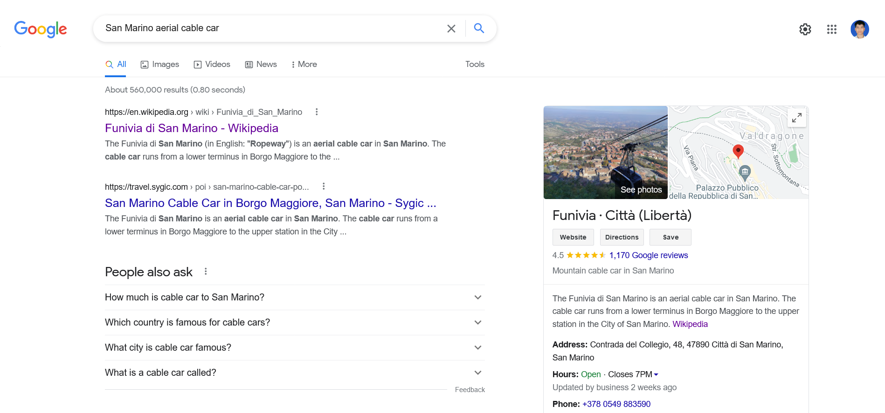
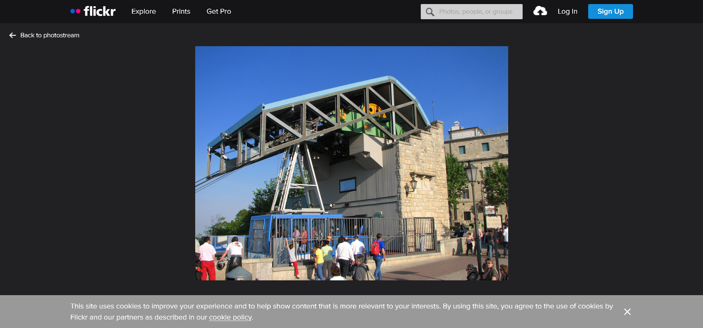

# Địa lý lớp 6

## Description

Tìm tọa độ của mỗi vị trí. Format flag: flag{vĩ độ hình 1, kinh độ hình 1, vĩ độ hình 2, kinh độ hình 2}. Vĩ độ và kinh độ chính xác tới 3 chữ số thập phân sau dấu phẩy và không chứa khoảng cách trong flag.

[picture1](files/picture1.png)   [picture2](files/picture2.png)
## Solution

### Picture2

With the **picture2**, I see the flag and think this is a national flag (I don't think this is flag of state or city, I don't know why). I search the Google all National Flag and combine with badge on the wall at the right side of the picture, I found this is Flag of **San Marino**. After that, I search Google with `San Marino aerial cable car` and found the location :)

For more information, I use images tab on this search, and found the photo on [Flickr](https://www.flickr.com/photos/checco/2455494686) which I see badge on the wall is the same as badge in challenge photo

Back to the Google search page, follow the search to Google Maps, the location is (43.938180890095346, 12.446111330686678) which round up to three decimal places is (43.938,12.446)

### Picture1

I use [this website](https://www.where-is-this.com/index/view/14890.html) to locate that location 

The location is (35.898042688725354, 14.518019806999227) which round up to three decimal places is (35.898,14.518)

## Flag

> flag{35.898,14.518,43.938,12.446}